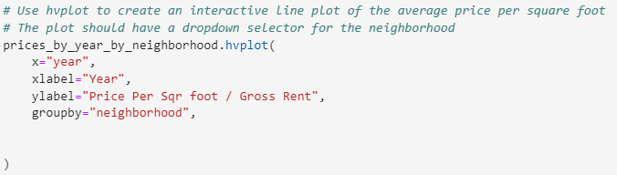
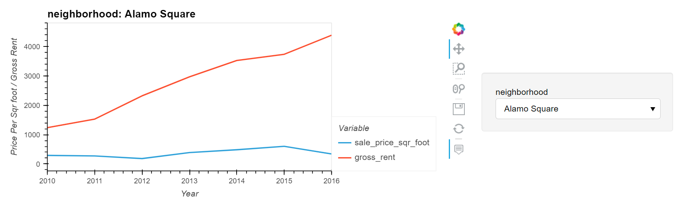
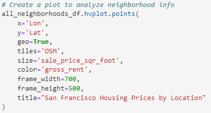
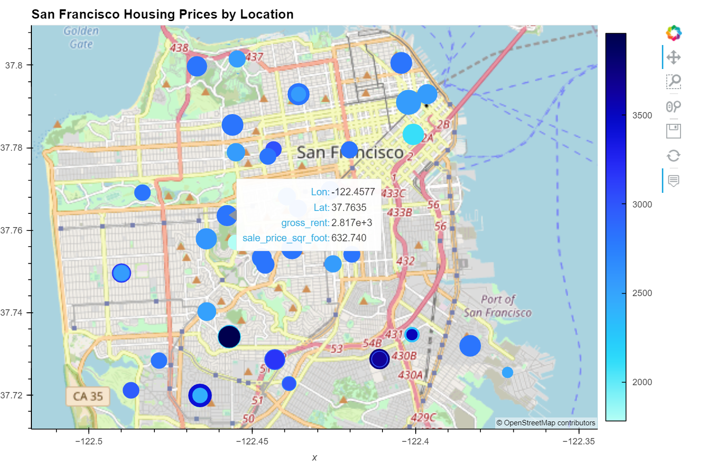

# San Francisco Housing Market Analyzer
Analyzing housing and rent patterns in San Francisco area to identify proiftable real estate opportunities. Allows user to adjust neighborhood view on interactive map and to hover over areas for additional information. New feautures added as needed. Run on jupyterlab. Data gathered from 

--- 

## Technologies/Data

This project leverages Python 3.7 and Jupyter Lab with the following packages:

* [Pandas] (https://github.com/pandas-dev/pandas) - To create and manipulate dataframes
* [Bokeh] (https://github.com/bokeh/bokeh) - Used to create interactive map 
* [HVPlot] (https://github.com/holoviz/hvplot) - Used to create visuals for data analysis

(Import code blocks included in application)

Data was gathered from:
* [Sfgov.org] (https://data.sfgov.org)

--- 

## Installation Guide

Before running the application, first install the following dependencies 

```python
  pip install pandas
  pip install bokeh
  pip install hvplot
```

---

## Usage

To access the interactive visualizations, clone the repository and run the **housing_analysis.ipynb** on Jupyter Lab. 

Upon running all of the cells you will see graphical visualizations of various gauages for housing market health in San Francisco. 

Run the following code to access the interactive graph showing (price per sq foot/ gross rent) over time:


You are able to view the neighborhood of your choice by using the dropdown menu to the right.


---
Run the following code to access the interactive heat-map of all the San Francisco neighborhoods:


Hovering over each circle allows the user to view the sale price per square foot of the neighborhood. The blue heatmap is representing gross rent: the darker the blue the higher the gross rent.



--- 


